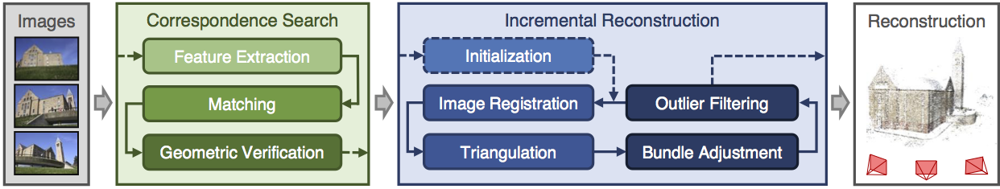
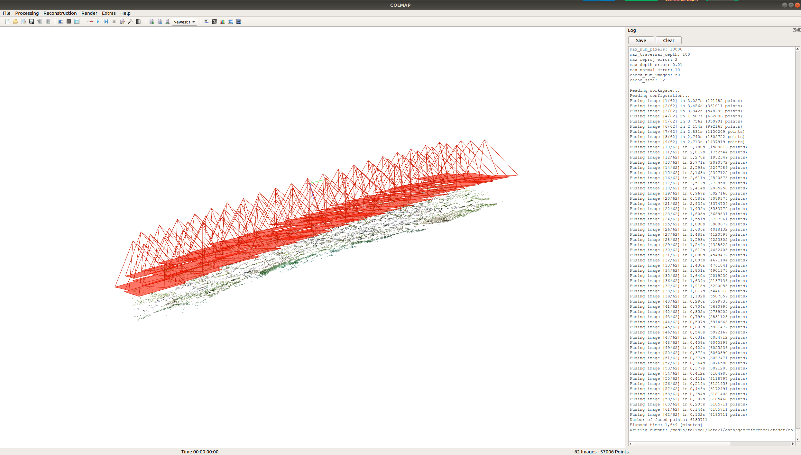
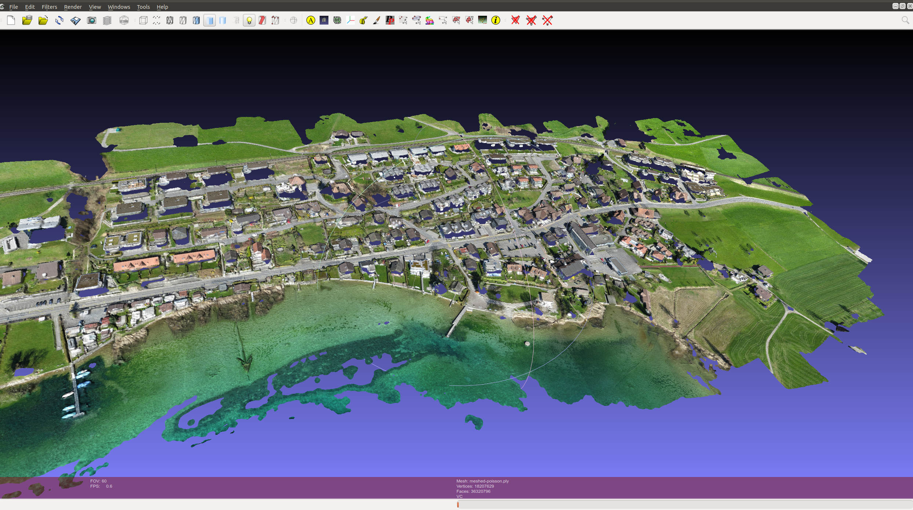
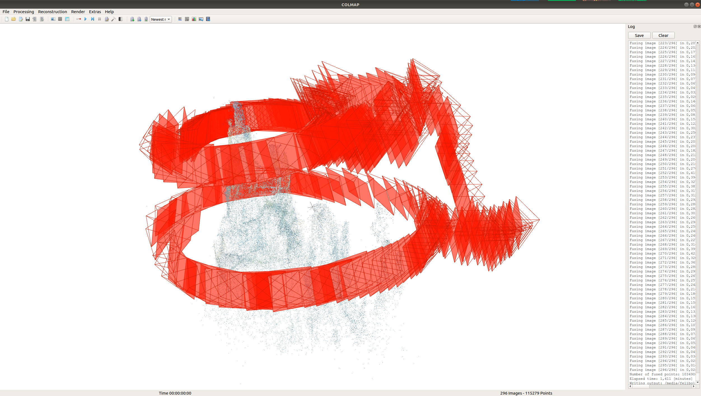
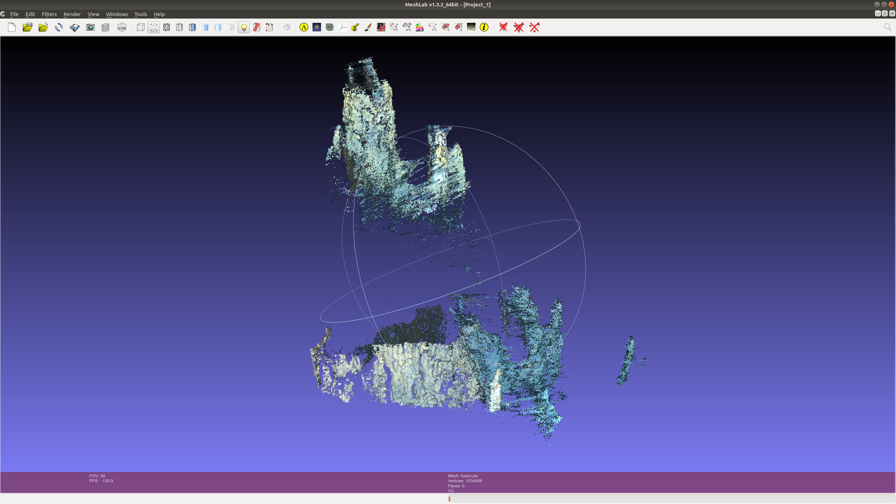

# COLMAP
COLMAP is a general-purpose Structure-from-Motion (SfM) and Multi-View Stereo (MVS) pipeline with a graphical and command-line interface. It offers a wide range of features for reconstruction of ordered and unordered image collections. 

The software is licensed under the new BSD license.

COLMAP can be used as an independent application through the command-line or graphical user interface. Alternatively, COLMAP is also built as a reusable library, i.e., you can include and link COLMAP against your own source code.



### Dependencies;
- Boost
- Eigen3
- Suitesparse
- FreeImage
- Gflags
- GLEW
- QT5
- CGAL
- Ceres Solver

### My comments
- Colmap is using GPU (CUDA) and CPU. 
- Documentation and library seem proper and well structured.
- Has a UI and command line options and also supports usage as a library. 
- Does not have orthophoto generation etc. 
- Several different feature matching algorithms are already implemented.
- Supports different camera models such as SIMPLE_PINHOLE, SIMPLE_RADIAL, OPENCV, RADIAL_FISHEYE, OPENCV_FISHEYE, FOV, THIN_PRISM_FISHEYE
- Calibration params should be supported via exif or manually
- There is a built-in loop detection based on a vocabulary tree, they support also  pre-trained vocabulary tree

## To Build and Run

### Build
Get source code and install dependencies
```bash
$ git clone https://github.com/colmap/colmap
$ sudo apt-get install \
    git \
    cmake \
    build-essential \
    libboost-program-options-dev \
    libboost-filesystem-dev \
    libboost-graph-dev \
    libboost-regex-dev \
    libboost-system-dev \
    libboost-test-dev \
    libeigen3-dev \
    libsuitesparse-dev \
    libfreeimage-dev \
    libgoogle-glog-dev \
    libgflags-dev \
    libglew-dev \
    qtbase5-dev \
    libqt5opengl5-dev \
    libcgal-dev \
    libcgal-qt5-dev
```

Install Ceres
```bash
$ sudo apt-get install libatlas-base-dev libsuitesparse-dev
$ git clone https://ceres-solver.googlesource.com/ceres-solver
$ cd ceres-solver
$ git checkout $(git describe --tags) # Checkout the latest release
$ mkdir build
$ cd build
$ cmake .. -DBUILD_TESTING=OFF -DBUILD_EXAMPLES=OFF
$ make
$ sudo make install
```

Configure and compile COLMAP
```bash
$ cd colmap
$ git checkout dev
$ mkdir build
$ cd build
$ cmake ..
$ make
$ sudo make install
```

### Run colmap GUI

```bash
$ cd colmap/build/src/exe
$ ./colmap gui
```
COLMAP provides an automatic reconstruction tool that simply takes a folder of input images and produces a sparse and dense reconstruction in a workspace folder. Click Reconstruction > Automatic Reconstruction in the GUI and specify the relevant options. The output is written to the workspace folder. For example, if your images are located in path/to/project/images, you could select path/to/project as a workspace folder.

## Results and Screenshots;




[COLMAP Dense Mesh PLY file](fused.ply)