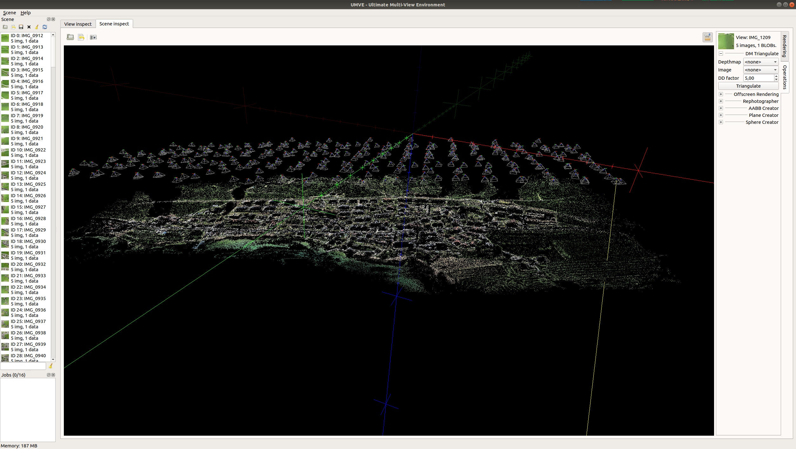
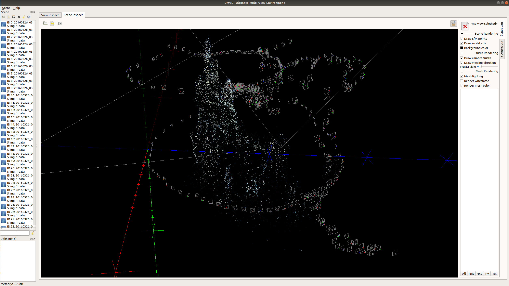
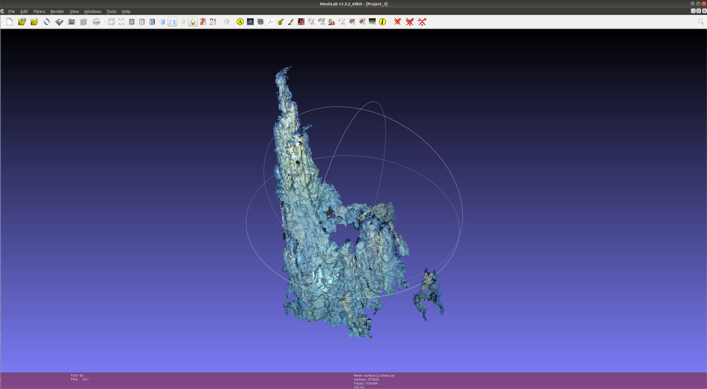

# Multi View Environment

"The Multi-View Environment is an effort to ease the work with multi-view datasets and to support the development of algorithms based on multiple views. It features Structure from Motion, Multi-View Stereo and Surface Reconstruction. MVE is developed at the TU Darmstadt. Visit the following website for more details.
- https://www.gcc.tu-darmstadt.de/home/proj/mve/
- https://pdfs.semanticscholar.org/c9f8/c6ff1c1e52db988fe6b0f6d1bf144fd6be4a.pdf"
- https://github.com/simonfuhrmann/mve

### Requirements
- libjpeg (for MVE, http://www.ijg.org/)
- libpng (for MVE, http://www.libpng.org/pub/png/libpng.html)
- libtiff (for MVE, http://www.libtiff.org/)
- OpenGL (for libogl in MVE and UMVE)
- Qt5 (for UMVE, http://www.qt.io)

### The MVE libraries support the following features:
- A view container for per-view data (camera parameters, images, arbitrary data).
- A scene management which aggregates multiple views.
- Image loaders, writers and various image processing tools.
- Mesh loaders, writers and various mesh processing tools.
- Various cross-platform routines (argument parser, timer, string processing, tokenizer, endian conversion, threads and mutex, smart pointer, file system abstraction, atomic operations, sleep, …)
- Some mathematical data types and routines (vector, matrix, quaternion, geometric predicates, …)
- A simple OpenGL abstraction for rapid OpenGL visualization.
- Python bindings for MVE are available here: https://github.com/davll/py-mve

### The MVE reconstruction pipeline is composed of the following components:
- Creating a dataset, by converting input photos into the MVE File Format.
- Structure from Motion, which reconstructs the camera parameters.
- Multi-View Stereo, which reconstructs dense depth maps for each photo.
- Surface Reconstruction, which reconstructs a surface mesh.

### My comments;
- It is an incremental SfM implementation.
- Has commandline tools and its own user interface UMVE in `apps/umve`.
- User interface is just for visualizing results. 
- Does not support GPU accel but SSE accel. is available. 
- There is no orthophoto or mosaic output.
- Very slow with respect to Meshroom and ODM.
- Rely on exif tags for initilize focal length and try to find sensor size from their camera database.

## To Build and Run

### Build
```bash
$ git clone https://github.com/simonfuhrmann/mve.git
$ cd mve
$ make -j8
```

For user interface 

```bash
$ cd apps/umve/
$ qmake && make -j8
$ ./umve
```

### Run

- Example pipeline;

```bash
$ makescene -i <image-dir> <scene-dir>
$ sfmrecon <scene-dir>
$ dmrecon -s2 <scene-dir>
$ scene2pset -F2 <scene-dir> <scene-dir>/pset-L2.ply
$ fssrecon <scene-dir>/pset-L2.ply <scene-dir>/surface-L2.ply
$ meshclean -t10 <scene-dir>/surface-L2.ply <scene-dir>/surface-L2-clean.ply
```


## Results and Screenshots;




[PLY file of this result](surface-L2-clean.ply)
