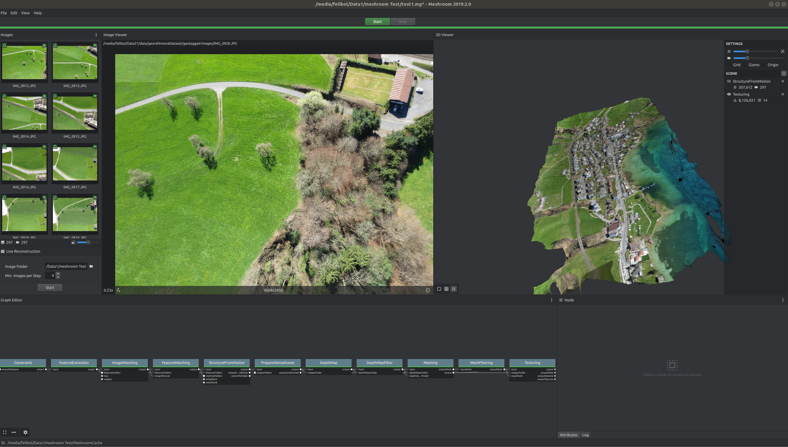
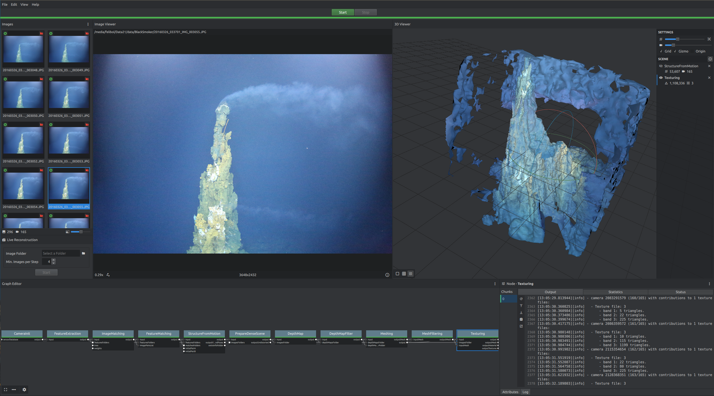

# Meshroom

"We build a fully integrated software for 3D reconstruction, photomodeling and camera tracking. We aim to provide a strong software basis with state-of-the-art computer vision algorithms that can be tested, analyzed and reused. Links between academia and industry is a requirement to provide cutting-edge algorithms with the robustness and the quality required all along the visual effects and shooting process.
This open approach enables both us and other users to achieve a high degree of integration and easy customisation for any studio pipeline."
"Meshroom allows you to run the whole photogrammetric pipeline. Put your images and it will generate a textured mesh automatically."
https://alicevision.org/

### History of the project;
- In 2009, CMP research team from CTU started the PhD thesis of Michal Jancosek supervised by Tomas Pajdla. They released windows binaries of their MVS pipeline, called CMPMVS, in 2012. 
- In 2009, Toulouse INP, INRIA and Duran Duboi started a French ANR project to create a model based Camera Tracking solution based on natural features and a new marker design called CCTag. 
- In 2010, Mikros Image and IMAGINE research team (a joint research group between Ecole des Ponts ParisTech and Centre Scientifique et Technique du Batiment) started a partnership around Pierre Moulon’s thesis, supervised by Renaud Marlet and Pascal Monasse on the academic side and Benoit Maujean on the industrial side. 
- In 2013, they released an open source SfM pipeline, called openMVG (“Multiple View Geometry”), to provide the basis of a better solution for the creation of visual effects matte-paintings. 
- In 2015, Simula, Toulouse INP and Mikros Image joined their efforts in the EU project POPART to create a Previz system based on AliceVision. 
- In 2017, CTU join the team in the EU project LADIO to create a central hub with structured access to all data generated on set based on AliceVision.

https://github.com/alicevision/meshroom

### My comments;
- Alicevision is an OpenMVG Fork
- Does not produce orthophoto or mosaic
- Has very good user interface
- Using GPU for accel. (They are using CUDA and somehow they are trying to get rid of it :) because of vendor dependent structure and broke libre software philosophy )

## They have also some other softwares, tools; 
### ofxMVG Camera Localization OpenFX Plugin for Nuke
The CameraLocalizer plugin estimates the camera pose of an image regarding an existing 3D reconstruction generated by Meshroom.

### AliceVision Photogrammetric Computer Vision framework
AliceVision is a Photogrammetric Computer Vision framework for 3D Reconstruction and Camera Tracking.
 
### PopSIFT Scale-Invariant Feature Transform (SIFT)
This library provides a GPU implementation of SIFT. 25 fps on HD images on recent graphic cards.

## To Build and Run
Just download [linux image](https://github.com/alicevision/meshroom/releases), extract and run executable(`./Meshroom`)
## Results and Screenshots;

[Textured Mesh result for underwater image data set](MeshroomTexturedMesh.obj)
