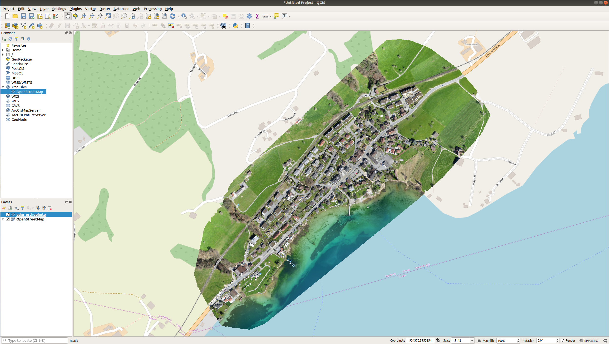
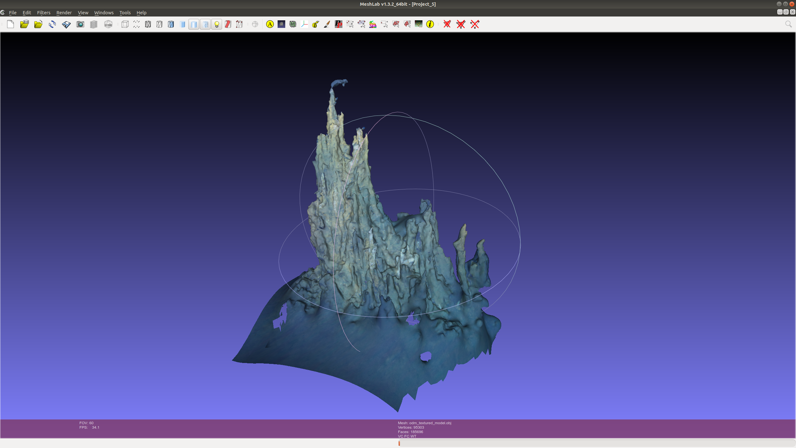

# Open Drone Map
OpenSfM and OpenDroneMap could be used as an alternative for the VisualSFM & CMPMVS process. OpenSfM is a free open source SfM library, which reconstructs only point clouds. OpenDroneMap implements OpenSfM and extends to solid 3D model reconstruction. OpenSfM and OpenDroneMap can integrates GPS information for robustness.

The split-merge process takes advantage of OpenSfM, the set of algorithms responsible for generating the 3-dimensional point cloud, being the first major step in the ODM toolchain. In short, OpenSfM extracts unique features from each image as points, matches those features to neighboring images using GPS information provided, and then incrementally builds a point cloud of shared points using constraining parameters. In this new process, after the images are matched, we split the images into smaller, overlapping clusters called submodels. Then the incremental reconstruction is performed on each submodel. Because these clusters have overlapping geographic extents, their points are able to be aligned with each other before the rest of the ODM process continues. Each submodel, therefore, is run like a mini ODM project. Finally, the orthophoto maps created by each submodel are merged into a final map.

HAHOG is the name OpenSfM uses for the combination of Hessian Affine feature point detector + HOG descriptor. The HOG descriptor is the same as used in SIFT, the detector is different. The code in OpenSfM for this is BSD licensed.

OpenSFM library is written in Python. The library serves as a processing pipeline for reconstructing camera poses and 3D scenes from multiple images. It consists of basic modules for Structure from Motion (feature detection/matching, minimal solvers) with a focus on building a robust and scalable reconstruction pipeline. It also integrates external sensor (e.g. GPS, accelerometer) measurements for geographical alignment and robustness. A JavaScript viewer is provided to preview the models and debug the pipeline.

https://github.com/OpenDroneMap/ODM

https://www.opendronemap.org/

### OpenSfM depends on the following libraries
- OpenCV
- OpenGV
- Ceres Solver
- NumPy, SciPy, Networkx, PyYAML, exifread

### Supported Outputs
- Orthorectified Imagery
- Digital Surface Models
- Digital Terrain Models
- Textured 3D models
- Classified Point Clouds

### My comments;
- It is complete, robust pipeline and has several modules like webodm which is a web interface for the odm. - It produces geotiff. 
- They support also docker image to simply run it. 
- Multiple machines can be used for split tasks and then combine back. 
- OpenSFM is BSD licensed.
- Different camera models(projection type) are supported 'auto', 'perspective', 'brown', 'fisheye', 'spherical'
- Semi Global Matching is supported
- If an image does not have GPS information in Exif, it is matched with ALL other images. A warning is written in the logs when that happens.
- Rely on exif tags for ocal length, without exif with focal length
    - OpenDFM will still work. However, the output will be grossly inaccurate in the sense that proportions will match but distances will not. If no GPS data is available at all then OpenSfM will do reconstruct a point cloud but the resulting camera positions will have 0 N 0 E (or close to) or no geographic coordinates. If any image lacks the FocalLength tag then OpenSfM assumes a default focal ratio (a quotient of focal plane width and focal length) of 0.85 which is roughly the mean focal ratio for most smartphones on the market.
- There is no loop closure in OpenSFM

## To Build and Run
If you have Docker installed, place your JPGs in a folder named “images” (for example /my/project/images) , then simply run:
```bash
$ docker run -ti --rm -v /my/project:/datasets/code opendronemap/odm --project-path /datasets
```

### The steps are:
- Images metadata extraction (GPS location, coordinate system)
- Structure from motion (from images to camera positions/orientations and sparse point cloud). We use OpenSfM for this.
- Multi view stereo (from camera + images to dense point clouds)
- Meshing (from points clouds to triangle meshes, we use mostly a Poisson Reconstruction approach but have support for 2.5D meshing as well)
- Texturing (from camera + images + meshes to textured meshes)
- Georeferencing (from local coordinates + GPS and/or ground control points to real world coordinates)
- DSM/DTM (from real world points to elevation models)
- Orthophoto generation (from textured meshes in real world coordinates to GeoTIFF)

## Results and Screenshots;


[Textured 3D Model](odm_textured_model.obj)