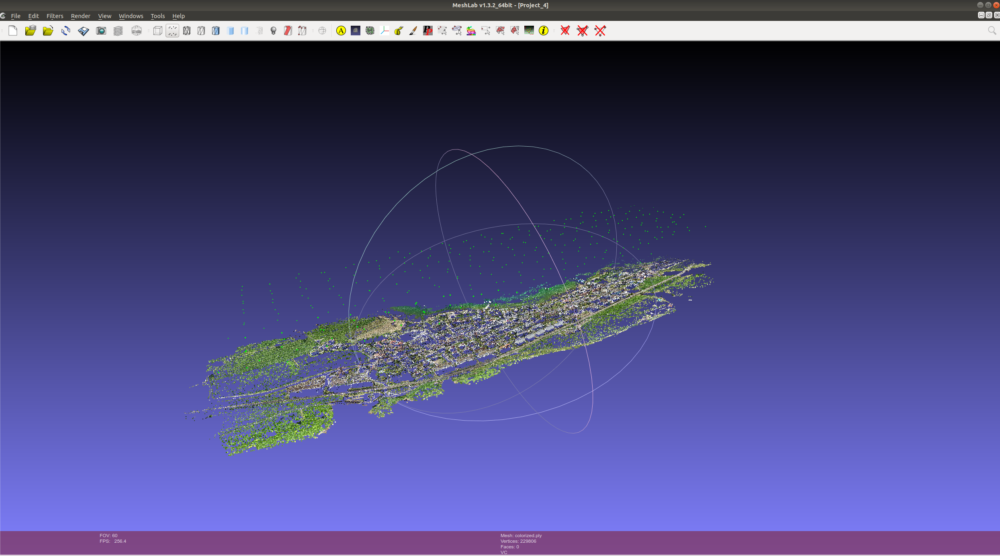
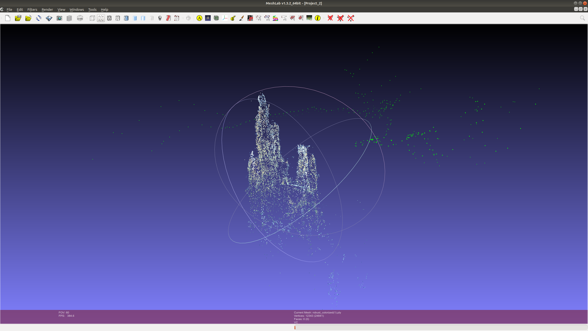

# OpenMVG
OpenMVG (Multiple View Geometry) "open Multiple View Geometry" is a library for computer-vision scientists and especially targeted to the Multiple View Geometry community. It is designed to provide an easy access to the classical problem solvers in Multiple View Geometry and solve them accurately.

The openMVG credo is: "Keep it simple, keep it maintainable". OpenMVG targets readable code that is easy to use and modify by the community.

All the features and modules are unit tested. This test driven development ensures that the code works as it should and enables more consistent repeatability. Furthermore, it makes it easier for the user to understand and learn the given features.

It is designed to provide an easy access to:
- Accurate Multiple View Geometry problem solvers,
- Tiny libraries to perform tasks from feature detection/matching to Structure from Motion,
- Complete Structure from Motion pipelines.

### Dependencies
OpenMVG library uses the git submodule idea to make its repository lighter.
- Here are the libraries used through the submodule concept:
    - GLFW 
    - OPENEXIF
    - OSI CLP

https://openmvg.readthedocs.io/en/latest/

### My comments;
- Have minimal dependencies like png zlib jpeg libraries
- Has good documentation
- Not using GPU, but it seems like some cuda implementations will be added (like cuda sift) they are working on it

## To Build and Run

### Build

1. Install the required external libraries.
```bash
$ sudo apt-get install libpng-dev libjpeg-dev libtiff-dev libxxf86vm1 libxxf86vm-dev libxi-dev libxrandr-dev
```
If you want see the view graph svg logs, install Graphviz.
```bash
$ sudo apt-get install graphviz
```

2. Checkout OpenMVG.
```bash
$ git clone --recursive https://github.com/openMVG/openMVG.git
$ mkdir openMVG_Build && cd openMVG_Build
```

3. Configure and build

```bash
$ cmake -DOpenMVG_BUILD_TESTS=ON -DOpenMVG_BUILD_EXAMPLES=ON -DOpenMVG_BUILD_SOFTWARES=ON -DOpenCV_DIR="/opencv-installations/opencv3/share/OpenCV/" -DOpenMVG_USE_OPENCV=ON  -DCMAKE_BUILD_TYPE=RELEASE -DCMAKE_INSTALL_PREFIX:STRING="/openMVG/install/" ../src/
```
OR

```bash
$ cmake -DCMAKE_BUILD_TYPE=RELEASE ../openMVG/src/
$ cmake --build . --target install
```

Run tests using make or ctest (if requested in the CMake command line with `-DOpenMVG_BUILD_TESTS=ON`)
```bash
$ make test
$ ctest --output-on-failure -j
```

### Run

```bash
$ cd openMVG/build/software/SfM/
$ python SfM_GlobalPipeline.py images/ SFMtestOutput/
```

## Results and Screenshots;

