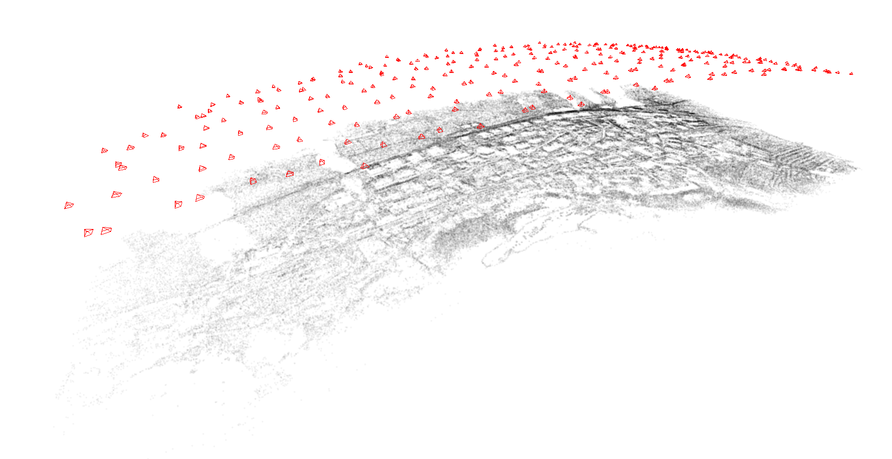
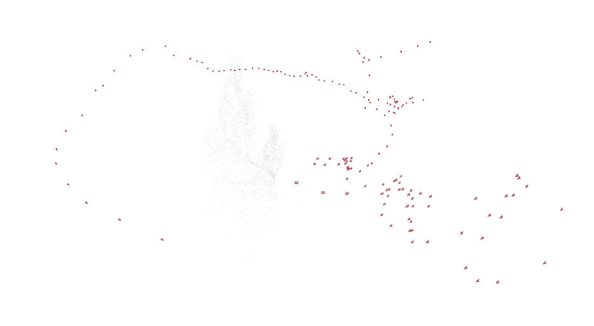

# Theia
Theia is an end-to-end structure-from-motion library that was created by Chris Sweeney. It is designed to be very efficient, scalable, and accurate. All steps of the pipeline are designed to be modular so that code is easy to read and easy to extend.

Theia is a computer vision library developed by Chris Sweeney aimed at providing efficient and reliable algorithms for Structure from Motion (SfM). The goal of this library is to provide researchers with an out of the box tool for multi-view reconstruction that can be easily extended. Many common algorithms for pose, feature detection and description, matching, and reconstruction have been implemented. All contain simple interfaces, limited dependencies, and extensive documentation.

Theia achieves state-of-the-art SfM performance on large-scale datasets. Efficiency and robustness is a key component of the library.

### Dependencies
Theia relies on a number of open source libraries. Luckily, most of the will be included in Ceres
- eigen3 is used extensively for doing nearly all the matrix and linear algebra operations.
- OpenImageIO is used to read and write image files. It is recommended to install version 1.6 or higher.
- Ceres Solver is a library for solving non-linear least squares problems. In particular, Theia uses it for Bundle Adjustment.

NOTE: Theia also depends on the following libraries, but they are included in the installation of Ceres so it is likely that you do not need to reinstall them.
- google-glog is used for error checking and logging. Ceres needs glog version 0.3.1 or later. Version 0.3 (which ships with Fedora 16) has a namespace bug which prevents Ceres from building.
- gflags is a library for processing command line flags. It is used by some of the examples and tests.

http://www.theia-sfm.org/

### My comments;
- If calibration is not supported will try to find focal length from exif if can not find any information then set it to some default value
- Not successful for underwater black smoker dataset (maybe it needs to be fine tuned, i did not play with params a lot)
- Output of the sample application can be viewed by theia viewer, can not recognized by MeshLab
- Sample application just produced point cloud and cameras

## To Build and Run
### Build
```bash
$ git clone https://github.com/sweeneychris/TheiaSfM.git
$ cd TheiaSfM/
$ ls
$ mkdir build
$ cd build/
$ cmake ../
$ make -j8
$ make test
```

### Run
There is an sample application for building 3D reconstruction, to run it first modify flags file and then run as:
```bash
$ TheiaSfM/build/bin/build_reconstruction --flagfile=TheiaSfM/applications/build_reconstruction_flags.txt
$ TheiaSfM/build/bin/view_reconstruction --reconstruction=SfMtests/Theia-0
```

## Results and Screenshots;

